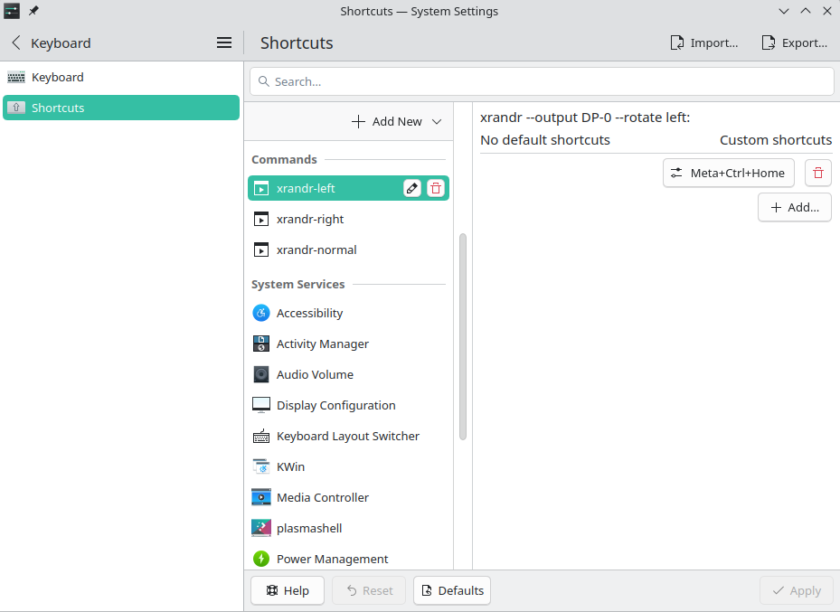
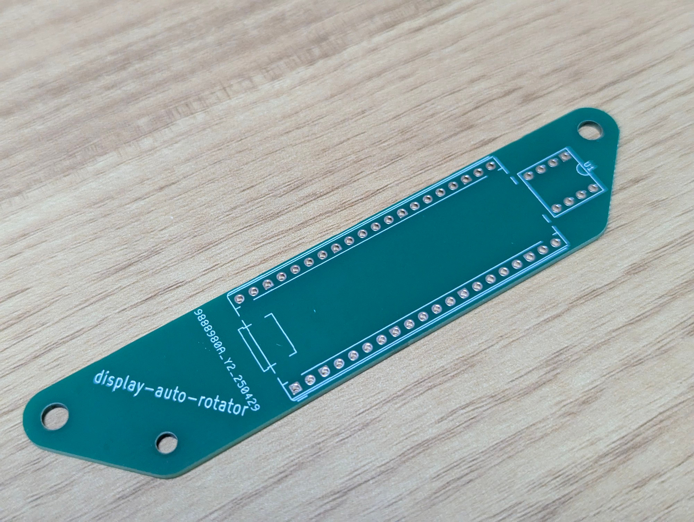
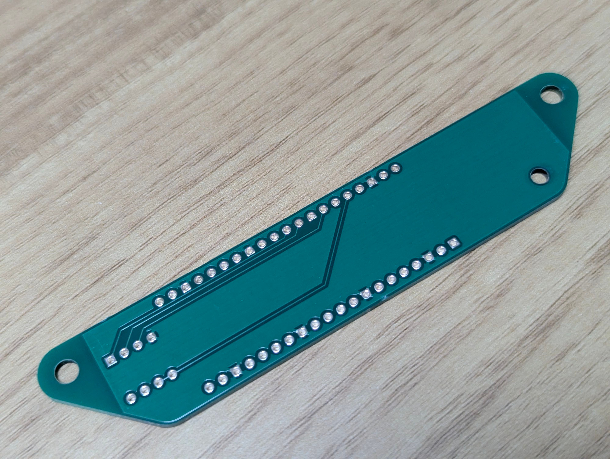
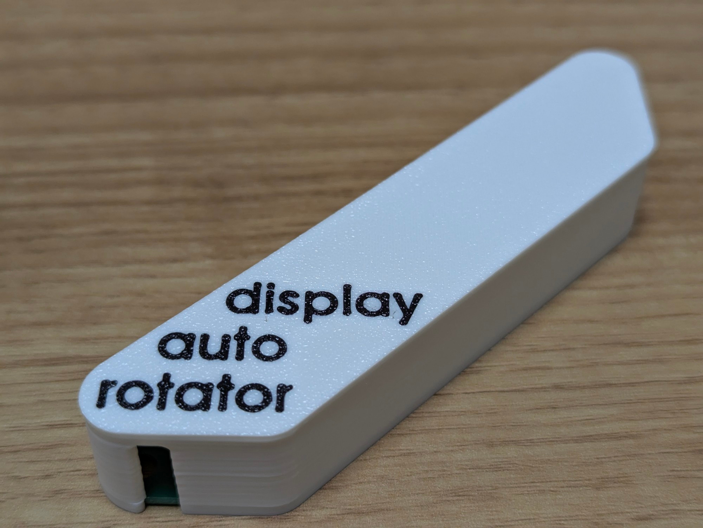
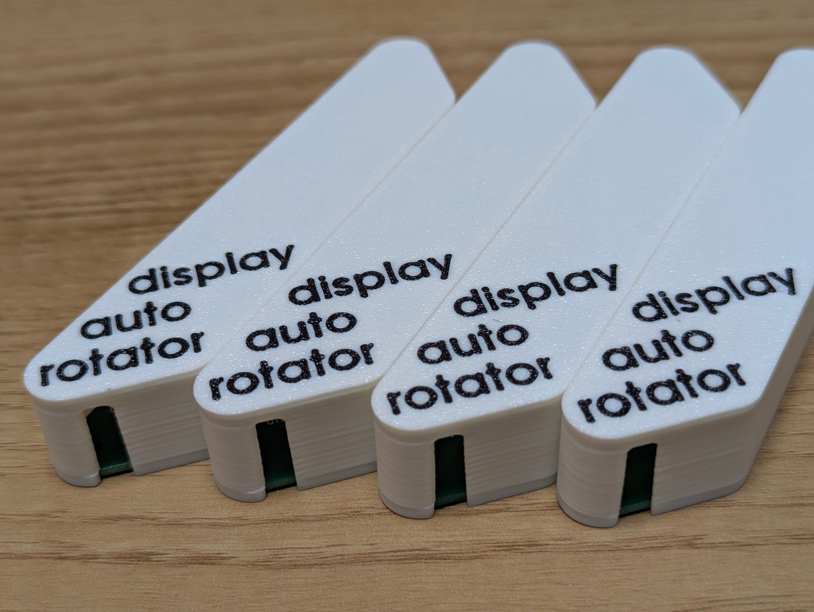
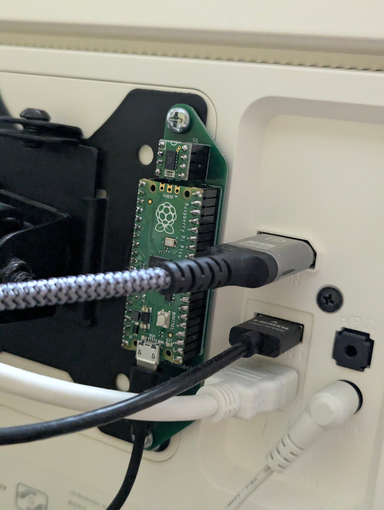
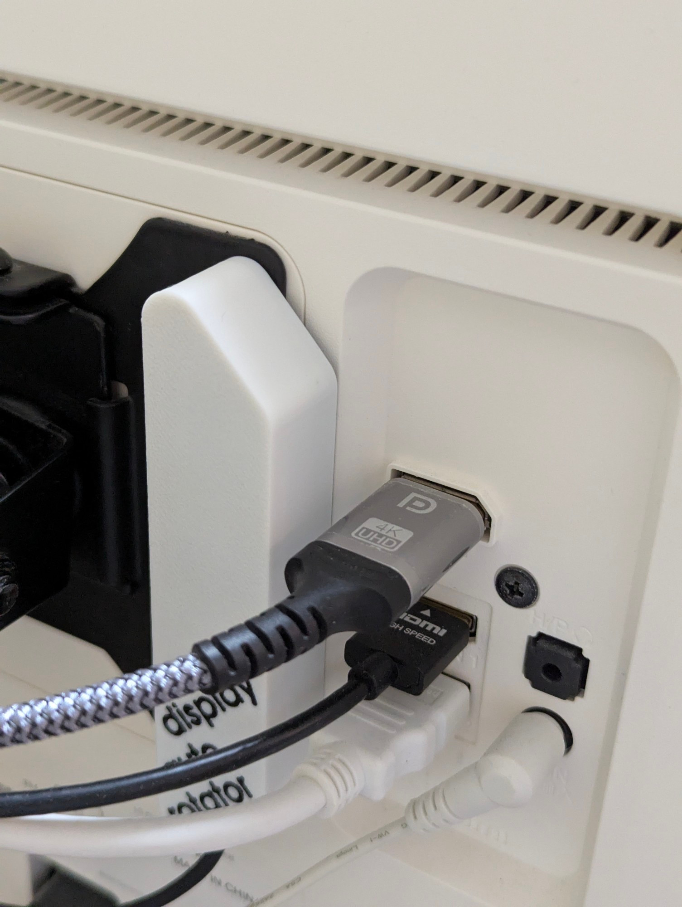
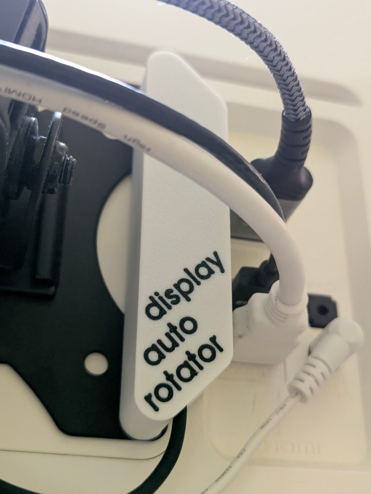

# display-auto-rotator

Rotate display automatically!

## Demo

https://github.com/user-attachments/assets/ae1f9217-fd95-40cb-a14e-61bc6282abff

See more at https://bsky.app/profile/hyrodium.bsky.social/post/3ln6qdv3mbs2j.

## Setup

### PC (host)

For example, you can setup the hotkeys like this in KDE Plasma environment.

- `Meta+Ctrl+Home`: `xrandr --output DP-0 --rotate left`
- `Meta+Ctrl+End`: `xrandr --output DP-0 --rotate right`
- `Meta+Ctrl+Up`: `xrandr --output DP-0 --rotate normal`

### Microcontroller (Raspi pico unit as HID keyboard)

#### Buy

- [raspberry pi pico](https://www.raspberrypi.com/products/raspberry-pi-pico/)
- [analog accelaration sensor](https://strawberry-linux.com/catalog/items?code=12101)

#### Order PCB

#### Print cover

Print STL files in `display-auto-rotator_3dp` directory.
https://www.thingiverse.com/thing:7035134

#### Assemble

#### Write firmware and scripts

- Download and write the CircuitPython firmware (https://circuitpython.org/board/raspberry_pi_pico/).
- Copy the following files to pico drive.
  - `CIRCUITPY/lib/adafruit_hid`
    - Copy from https://circuitpython.org/libraries.
  - `CIRCUITPY/code.py`
    - Copy from this repository.
  - `CIRCUITPY/boot.py`
    - Copy from this repository.
